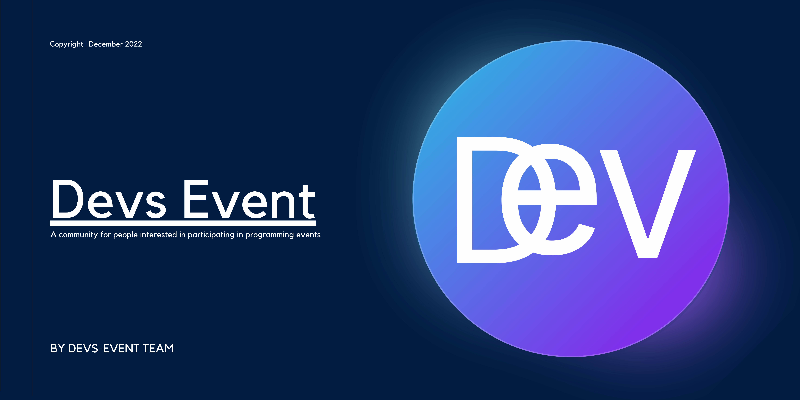
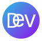

<h1 align="center" id="devs-event">
  Devs Event
</h1>

 

<h4 align="center"><strong>A community for people interested in participating in programming events</strong></h4>

  <a href="#introduction">Introduction</a> •
  <a href="#tech-stack">Tech Stack</a> •
  <a href="#roadmap">Roadmap</a> •
  <a href="#team-members">Team members</a> •
  <a href="#support">Support</a> •
  <a href="#contact">Contact</a>

<a href="https://github.com/othneildrew/Best-README-Template"><strong>Explore Front-end</strong></a> •
<a href="https://github.com/othneildrew/Best-README-Template"><strong>Explore Back-end</strong></a> Codes

<h2 id="introduction">
👋 Introduction
</h2>

Hey, I'm glad you're visiting our GitHub page. We are a remote startup trying to create a community for developers In <b>Iran</b>, Who are interested in participating in related events. Our job is to make it <b>more convenient</b>. And also make you a <b>good memory</b>, so enjoy the events.

<h2 id="tech-stack">
🤖 Tech Stack
</h2>

### Client:

>                

### Server: 

>      

### Others:

>      

<h2 id="roadmap">
🛣️ Roadmap
</h2>

- [x] add about page
- [ ] Add online rooms
- [ ] Additional browser support
- [ ] Add blog
    - [ ] Farsi
    - [ ] English

<h2 id="team-members">
👨🏻‍💻 Team members
</h2>

- [@vito-mohagheghian 👨🏻‍💻](https://www.github.com/vito-mohagheghian)

- [@mhdi-nzari 👨🏻‍💻](https://www.github.com/mhdi-nzari)

- [@moshahi 👨🏻‍💻](https://www.github.com/moshahi)

<h2 id="support">
💸 Support
</h2>

<h2 id="contact">
🦜 Contact
</h2>

    

<a href="#devs-event">back to top</a>

